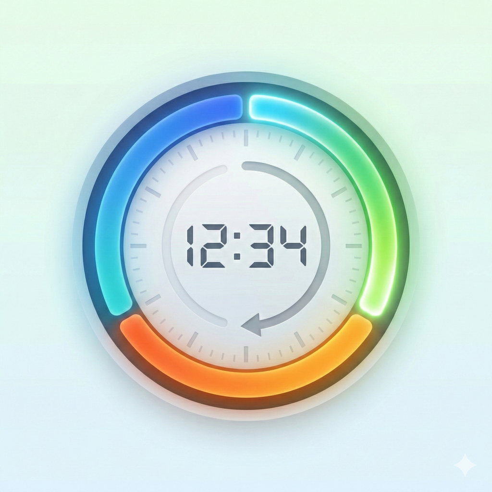
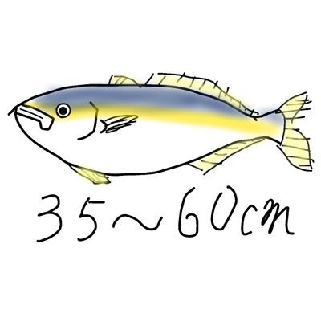
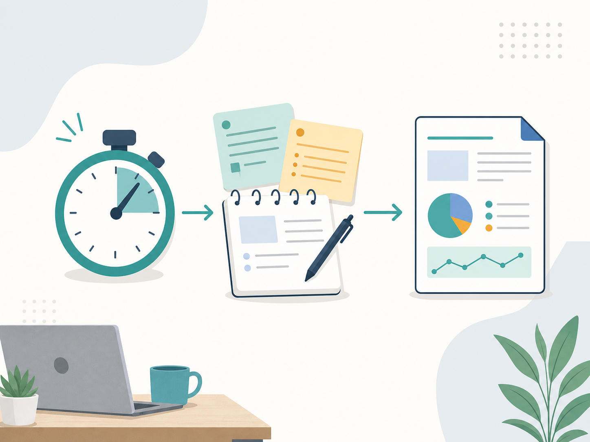
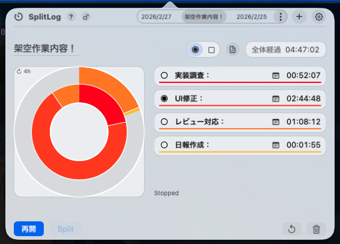
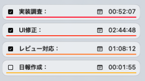
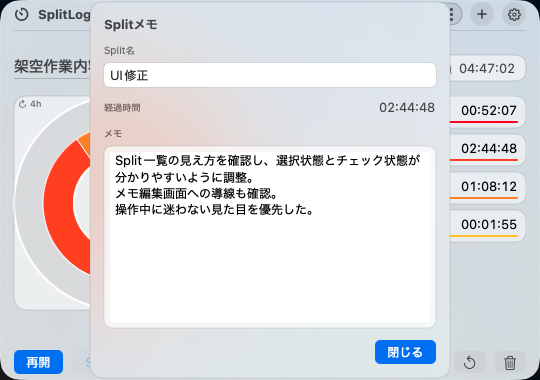
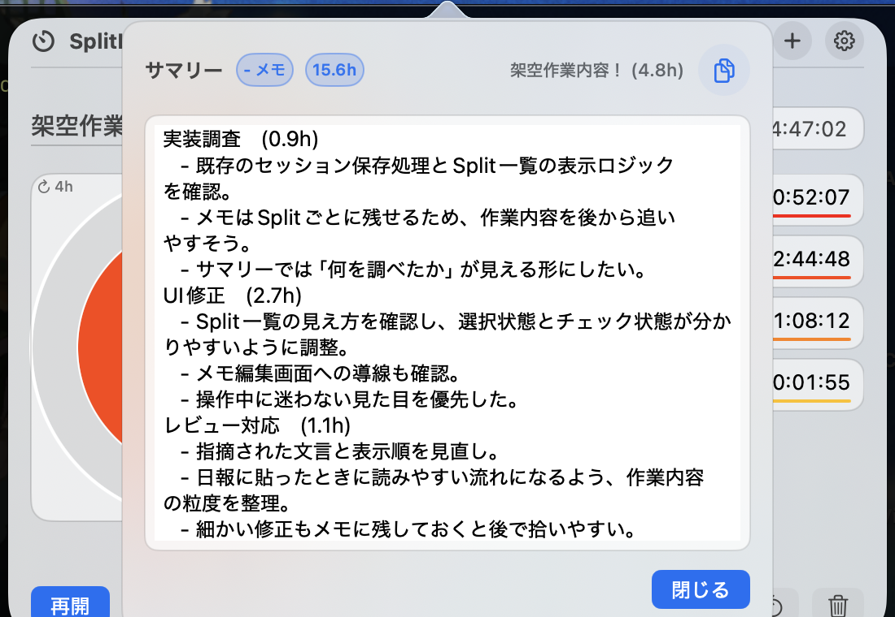
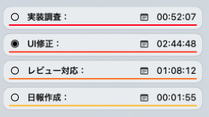
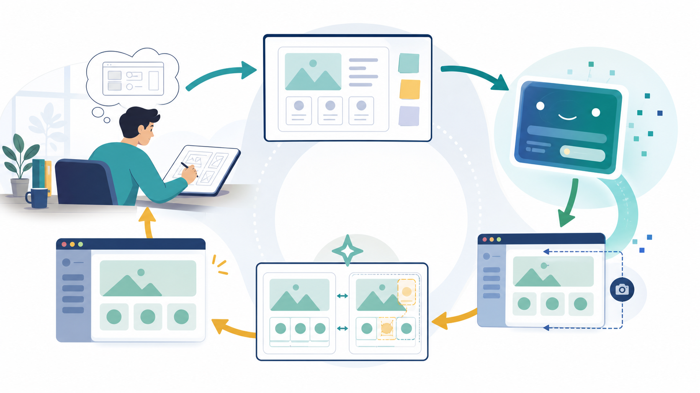
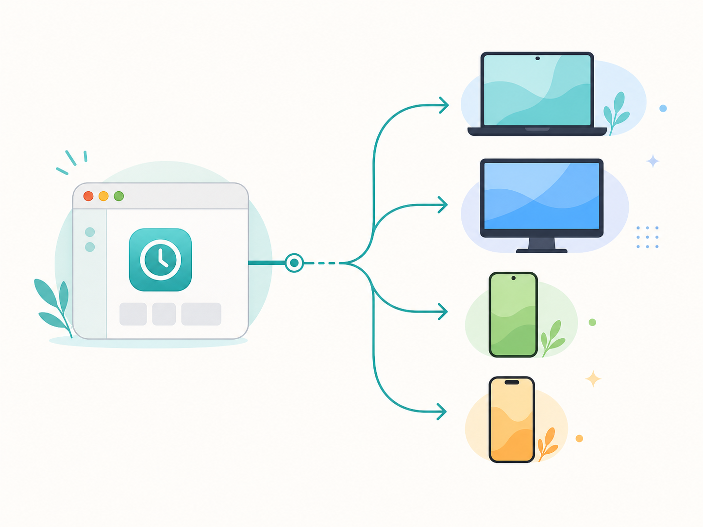

<!-- .slide: class="title-slide splitlog-title" -->

  
  

    
個人開発アプリ紹介

    <h1>SplitLogとは何なのか</h1>
    
作業時間とメモを、日報にそのまま使える形で残す

  

Note:
最初に、SplitLogは「時間を測るアプリ」というより、作業ログを日報に使える形で残すためのアプリとして紹介する。

---

<!-- .slide: class="content-slide" -->

## 自己紹介

  

    
    Presenter
    <h3>濱田 真仁</h3>
    
はまちゃん / はまちー

  

  

    

      

        <strong>役割</strong>
        
      

      
インターン生として、TaskTalkプロジェクトのタスク管理や開発を担当。

    

    

      <strong>AI活用</strong>
      
Codexを利用しながら、AIを使った開発の進め方を勉強中。

    

    

      <strong>作った理由</strong>
      
日報作成や作業時間の整理を、もう少し楽にしたかった。

    

  

Note:
自己紹介は短くする。細かい経歴より、日報作成に課題を感じてSplitLogを作った立場を伝える。

---

<!-- .slide: class="content-slide conclusion-slide" -->

## SplitLogを使って得た結論

日報は「思い出す」より 「残して整える」

SplitLogは、作業中の時間とメモを残し、最後に日報へ整えるために作ったアプリです。

  

    01
    <h3>作業中に残す</h3>
    
作業時間と作業内容を、Splitごとのログとしてその場で残す。

  

  

    02
    <h3>流れが残る</h3>
    
AI待ち、UI修正、レビュー対応など、並行する作業も分けて記録できる。

  

  

    03
    <h3>最後に整える</h3>
    
業務後はサマリーをコピーし、必要な部分だけ整えて日報に使う。

  

Note:
背景説明の前に、SplitLogで実際にできるようになったことを先に伝える。

---

<!-- .slide: class="content-slide effect-slide" -->

## 実際に使ってどう変わったか

  

    

      Before
      <strong>約15分</strong>
      
複数の情報源を見返し、作業内容と時間を思い出しながら日報を書く。

    

    
→

    

      After
      <strong>約1分</strong>
      
SplitLogのサマリーをコピーし、最後に少し整えて日報に使う。

    

  

  

    <h3>体感で、日報作成の仕上げ時間が短くなった</h3>
    
Splitごとのメモは作業中に追記する。業務後にまとめて思い出す時間を減らすのがポイント。

  

Note:
数字は体感。厳密な計測ではなく、約5ヶ月使ってみた感覚として説明する。逐次メモを書く時間は作業中に発生するが、業務終了後のまとめ作業は軽くなった、という表現にする。

---

<!-- .slide: class="content-slide" -->

## 作った背景

  

    

      01
      
作業時間を記録したいが、タスクごとに測るのが面倒

    

    

      02
      
AIと並行して進める作業が増え、ひとつのタイマーでは追いにくい

    

    

      03
      
日報を書くときに、時間・メモ・作業内容を集め直している

    

  

  

Note:
競合比較ではなく、自分の作業スタイルで起こっていた困りごととして説明する。

---

<!-- .slide: class="content-slide" -->

## SplitLogでやりたいこと

  

    

      

        <strong>測る</strong>
        
作業をSplit単位で区切り、タスクごとの時間を残す

      

      

        <strong>書く</strong>
        
各Splitにメモを付けて、作業内容をその場で残す

      

      

        <strong>まとめる</strong>
        
1日の作業をサマリー化し、日報へコピーできる

      

    

    
「測ったあとに使えるログ」までをアプリ内で完結させる

  

  

---

<!-- .slide: class="content-slide" -->

## 主な機能

  

    
    <h3>メニューバー常駐</h3>
    
必要なときだけ開ける。作業画面を邪魔しない。

  

  

    
    <h3>セッション管理</h3>
    
日ごと・作業単位でセッションを分けて保存できる。

  

  

    
    <h3>Splitごとの記録</h3>
    
時間、名前、メモをSplit単位で管理できる。

  

  

    
    <h3>サマリーコピー</h3>
    
日報や振り返りに貼り付けやすい形式で出力できる。

  

  

    
    <h3>ショートカット</h3>
    
Split、停止、再開、メモ表示をキーボードから操作できる。

  

  

    
    <h3>表示設定</h3>
    
テーマ、リング周期、サマリー形式などを調整できる。

  

---

<!-- .slide: class="content-slide app-shot-slide" -->

## 使い方のイメージ

  <figure class="app-shot-frame usage-main-shot">
    
    <figcaption>セッション「架空作業内容！」を開いた状態</figcaption>
  </figure>
  

    
<strong>1. 対象セッションを開く</strong> メニューバーからSplitLogを開き、今日の作業セッションを表示する。

    
<strong>2. 作業単位をSplitで見る</strong> 実装調査、UI修正、レビュー対応、日報作成のように作業を分ける。

    
<strong>3. 時間配分をざっくり把握する</strong> リングと一覧で、どの作業に時間を使ったかを確認できる。

  

Note:
まずセッション全体を見せて、SplitLogが何を記録するアプリなのかを実画面で説明する。

---

<!-- .slide: class="content-slide app-shot-slide" -->

## Splitとメモを残す

  <figure class="app-shot-frame split-list-shot">
    
    <figcaption>Split一覧：作業ごとの時間とメモを確認</figcaption>
  </figure>
  <figure class="app-shot-frame memo-edit-shot">
    
    <figcaption>メモ編集画面：その場で気づきを残す</figcaption>
  </figure>

  
<strong>Splitを選ぶ</strong> いま進めている作業を選び、時間をそのSplitに積む。

  
<strong>メモを残す</strong> 調べたこと、直したこと、次に見ることを作業中に短く書く。

  
<strong>後で拾える形にする</strong> 細かい作業も残しておくと、最後に日報へ整えやすい。

Note:
ここでは、Split一覧とメモ編集画面を分けて見せる。時間だけでなく、作業中の文脈も残すことを説明する。

---

<!-- .slide: class="content-slide app-shot-slide" -->

## 最後に日報へ整える

  <figure class="app-shot-frame summary-screen-shot">
    
    <figcaption>サマリー画面：Splitごとのメモをまとめて確認</figcaption>
  </figure>
  

    
<strong>1. サマリーを確認する</strong> 作業中に残したメモを、Splitごとの流れで見直す。

    
<strong>2. 必要な内容だけ整える</strong> 日報として読みやすい順番と文章に少し整える。

    
<strong>3. 思い出す時間を減らす</strong> 最後にゼロから考えるのではなく、残したログを使って仕上げる。

  

Note:
日報は最後に思い出して書くものではなく、作業中に残したログを整えるものだとつなげる。

---

<!-- .slide: class="content-slide app-shot-slide" -->

## 実画面で見る操作ポイント

  <figure class="app-shot-frame large-shot">
    
  </figure>
  

    

      1
      <h3>セッション名</h3>
      
いま記録している作業単位を上部で確認する。

    

    

      2
      <h3>リング</h3>
      
全体の時間配分を、色の割合でざっくり把握する。

    

    

      3
      <h3>Split一覧</h3>
      
作業名、メモ、経過時間をSplitごとに見る。

    

    

      4
      <h3>操作ボタン</h3>
      
再開、Split、停止、履歴、削除を必要なタイミングで使う。

    

  

Note:
この画面では、セッション名、時間配分、Splitごとの時間、操作ボタンが一画面にまとまっていることを説明する。

---

<!-- .slide: class="content-slide" -->

## 並行作業を前提にしたSplit

  

    <h3>ラジオ配分</h3>
    
    
今フォーカスしている1つのSplitに時間を積む。

    <small>集中して1タスクを進めるときに向いている</small>
  

  

    <h3>チェック配分</h3>
    
    
複数のSplitを有効にして、並行作業の時間を配分する。

    <small>AI待ち、自分の作業、レビューなどが並ぶときに使いやすい</small>
  

「作業は必ず1つだけ」と決めつけないところがポイント

---

<!-- .slide: class="content-slide" -->

## 軽い技術構成

  

    <h3>Presentation</h3>
    
SwiftUIのPopover UI AppKitのメニューバー制御

  

  
  

    <h3>Domain</h3>
    
StopwatchService Session / Split の状態管理

  

  
  

    <h3>Storage</h3>
    
sessions.json UserDefaults

  

<ul class="compact-list">
  <li>状態管理と画面表示を分け、UI変更に引きずられにくくした</li>
  <li>セッションはローカル保存し、次回起動後も参照できる</li>
  <li>主要な時間計測・Split操作はテストで検証している</li>
</ul>

Note:
コードの細かい説明はしない。社内共有として、構造を軽く紹介する程度にする。

---

<!-- .slide: class="content-slide" -->

## 作って得たナレッジ

  
  

    

      <h3>UIは絵で伝える</h3>
      
<strong>開発者</strong>がFigmaやスクリーンショットで理想形を作る。

      
<strong>AI</strong>がその絵を見て、実アプリのUIへ再現する。

    

    

      <h3>UXは操作前提で伝える</h3>
      
<strong>開発者</strong>が「何ができるか」「どう使うか」を明文化する。

      
<strong>AI</strong>が前提を踏まえて操作し、使いにくい箇所を見つける。

    

    

      <h3>修正ループを作る</h3>
      
<strong>AI</strong>が実アプリを操作し、スクリーンショットを撮影する。

      
<strong>AI</strong>が理想形と実画面を比較し、ズレを直す。

    

  

---

<!-- .slide: class="content-slide" -->

## 今後の展望

  

    

      Now
      
macOSのメニューバーアプリとして利用

    

    

      Next
      
日報に使いやすいサマリー表現をさらに改善

    

    

      Future
      
FlutterでmacOS / Windows / Android / iPhone対応を進める

    

  

  

---

<!-- .slide: class="content-slide closing-slide" -->

## まとめ

  
  

    

      
<strong>SplitLog</strong> は、作業時間・メモ・日報化をつなぐための個人開発アプリ

      
複数タスクやAIとの並行作業を前提に、Split単位でログを残せる

      
開発では、AIに任せる部分と人間が言語化すべき部分の切り分けが重要だった

    

作業ログを、あとで使える形にする

  

