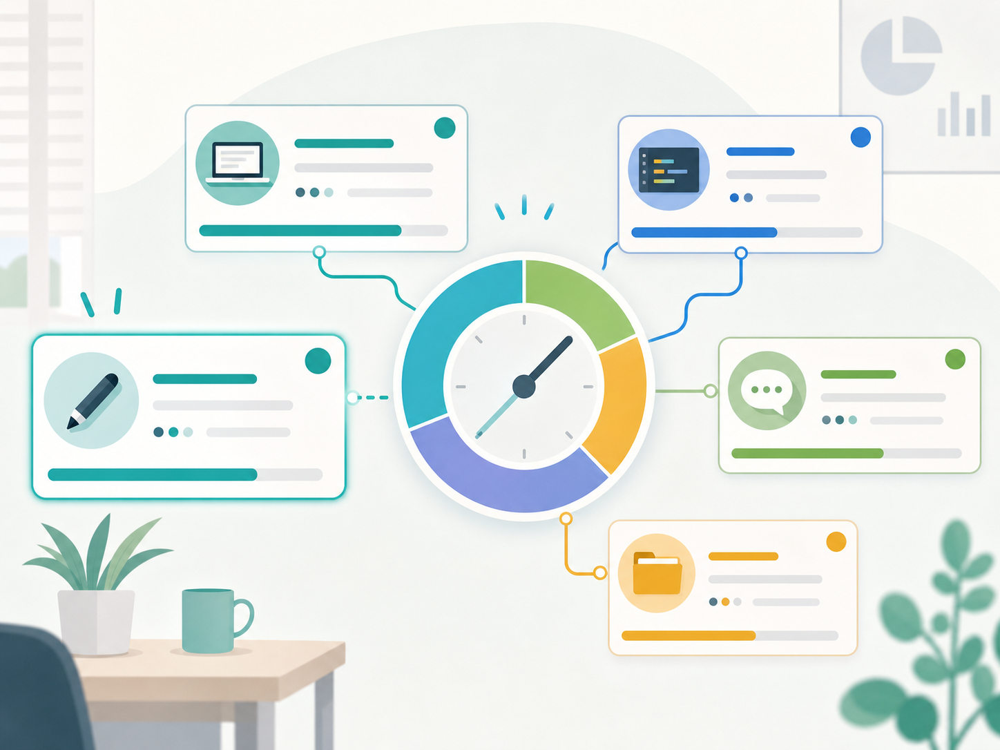

<!-- .slide: class="title-slide splitlog-title" -->

  
  

    
個人開発アプリ紹介

    <h1>SplitLogとは何なのか</h1>
    
作業時間とメモを、日報にそのまま使える形で残す

  

Note:
最初に、SplitLogは「時間を測るアプリ」というより、作業ログを日報に使える形で残すためのアプリとして紹介する。

---

<!-- .slide: class="content-slide" -->

## 作った背景

  

    

      01
      
作業時間を記録したいが、タスクごとに測るのが面倒

    

    

      02
      
AIと並行して進める作業が増え、ひとつのタイマーでは追いにくい

    

    

      03
      
日報を書くときに、時間・メモ・作業内容を集め直している

    

  

  

Note:
競合比較ではなく、自分の作業スタイルで起こっていた困りごととして説明する。

---

<!-- .slide: class="content-slide" -->

## SplitLogでやりたいこと

  

    

      

        <strong>測る</strong>
        
作業をSplit単位で区切り、タスクごとの時間を残す

      

      

        <strong>書く</strong>
        
各Splitにメモを付けて、作業内容をその場で残す

      

      

        <strong>まとめる</strong>
        
1日の作業をサマリー化し、日報へコピーできる

      

    

    
「測ったあとに使えるログ」までをアプリ内で完結させる

  

  

---

<!-- .slide: class="content-slide" -->

## 主な機能

  

    
    <h3>メニューバー常駐</h3>
    
必要なときだけ開ける。作業画面を邪魔しない。

  

  

    
    <h3>セッション管理</h3>
    
日ごと・作業単位でセッションを分けて保存できる。

  

  

    
    <h3>Splitごとの記録</h3>
    
時間、名前、メモをSplit単位で管理できる。

  

  

    
    <h3>サマリーコピー</h3>
    
日報や振り返りに貼り付けやすい形式で出力できる。

  

  

    
    <h3>ショートカット</h3>
    
Split、停止、再開、メモ表示をキーボードから操作できる。

  

  

    
    <h3>表示設定</h3>
    
テーマ、リング周期、サマリー形式などを調整できる。

  

---

<!-- .slide: class="content-slide app-shot-slide" -->

## 使い方のイメージ

  
開く

  
  
開始

  
  
Split / メモ

  
  
サマリーコピー

  

    
<strong>1. セッションを開く</strong> メニューバーからSplitLogを開き、対象セッションを表示する。

    
<strong>2. 作業を測る</strong> 再開して、進めている作業のSplitに時間を積む。

    
<strong>3. メモを残す</strong> 作業中に気づいたことをSplit単位で残す。

    
<strong>4. 日報へ渡す</strong> 最後にサマリーをコピーして、振り返りや日報に使う。

  

  <figure class="app-shot-frame">
    
    <figcaption>実際のSplitLog画面：セッション「架空作業内容！」</figcaption>
  </figure>

Note:
実アプリのスクリーンショットと、操作の流れを対応させて説明する。

---

<!-- .slide: class="content-slide app-shot-slide" -->

## 実画面で見る操作ポイント

  <figure class="app-shot-frame large-shot">
    
  </figure>
  

    

      1
      <h3>セッション名</h3>
      
いま記録している作業単位を上部で確認する。

    

    

      2
      <h3>リング</h3>
      
全体の時間配分を、色の割合でざっくり把握する。

    

    

      3
      <h3>Split一覧</h3>
      
作業名、メモ、経過時間をSplitごとに見る。

    

    

      4
      <h3>操作ボタン</h3>
      
再開、Split、停止、履歴、削除を必要なタイミングで使う。

    

  

Note:
この画面では、セッション名、時間配分、Splitごとの時間、操作ボタンが一画面にまとまっていることを説明する。

---

<!-- .slide: class="content-slide app-shot-slide" -->

## 日報につながる使い方

  

    

      <strong>測る</strong>
      
「実装調査」「UI修正」など、実際の作業名で時間を残す。

    

    

      <strong>分ける</strong>
      
割り込みやAI待ちを、別のSplitとして切り出す。

    

    

      <strong>書く</strong>
      
各Splitのメモに、やったことや判断を短く残す。

    

    

      <strong>まとめる</strong>
      
最後にサマリーをコピーし、日報や振り返りの下書きにする。

    

  

  <figure class="app-shot-frame compact-shot">
    
  </figure>

Note:
単なるタイマーではなく、あとで文章化しやすい作業ログを作る流れとして説明する。

---

<!-- .slide: class="content-slide" -->

## 並行作業を前提にしたSplit

  

    

      

        <h3>ラジオ配分</h3>
        
今フォーカスしている1つのSplitに時間を積む。

        <small>集中して1タスクを進めるときに向いている</small>
      

      

        <h3>チェック配分</h3>
        
複数のSplitを有効にして、並行作業の時間を配分する。

        <small>AIに任せた作業と自分の作業が並ぶときに使いやすい</small>
      

    

    
「作業は必ず1つだけ」と決めつけないところがポイント

  

  

---

<!-- .slide: class="content-slide" -->

## 軽い技術構成

  

    <h3>Presentation</h3>
    
SwiftUIのPopover UI AppKitのメニューバー制御

  

  
  

    <h3>Domain</h3>
    
StopwatchService Session / Split の状態管理

  

  
  

    <h3>Storage</h3>
    
sessions.json UserDefaults

  

<ul class="compact-list">
  <li>状態管理と画面表示を分け、UI変更に引きずられにくくした</li>
  <li>セッションはローカル保存し、次回起動後も参照できる</li>
  <li>主要な時間計測・Split操作はテストで検証している</li>
</ul>

Note:
コードの細かい説明はしない。社内共有として、構造を軽く紹介する程度にする。

---

<!-- .slide: class="content-slide" -->

## 作って得たナレッジ

  
  

    

      <h3>UIは絵で伝える</h3>
      
<strong>開発者</strong>がFigmaやスクリーンショットで理想形を作る。

      
<strong>AI</strong>がその絵を見て、実アプリのUIへ再現する。

    

    

      <h3>UXは操作前提で伝える</h3>
      
<strong>開発者</strong>が「何ができるか」「どう使うか」を明文化する。

      
<strong>AI</strong>が前提を踏まえて操作し、使いにくい箇所を見つける。

    

    

      <h3>修正ループを作る</h3>
      
<strong>AI</strong>が実アプリを操作し、スクリーンショットを撮影する。

      
<strong>AI</strong>が理想形と実画面を比較し、ズレを直す。

    

  

---

<!-- .slide: class="content-slide" -->

## 今後の展望

  

    

      Now
      
macOSのメニューバーアプリとして利用

    

    

      Next
      
日報に使いやすいサマリー表現をさらに改善

    

    

      Future
      
FlutterでmacOS / Windows / Android / iPhone対応を進める

    

  

  

---

<!-- .slide: class="content-slide closing-slide" -->

## まとめ

  
  

    

      
<strong>SplitLog</strong> は、作業時間・メモ・日報化をつなぐための個人開発アプリ

      
複数タスクやAIとの並行作業を前提に、Split単位でログを残せる

      
開発では、AIに任せる部分と人間が言語化すべき部分の切り分けが重要だった

    

作業ログを、あとで使える形にする

  

